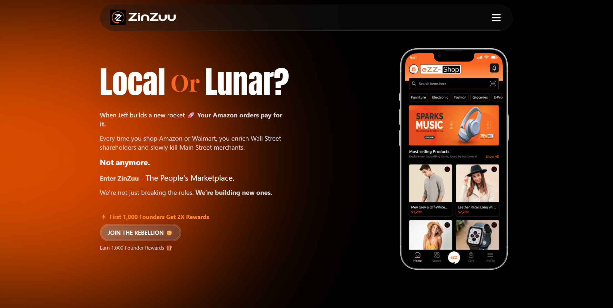

<!-- PROJECT LOGO / HERO IMAGE -->

  <!-- Replace the image URL below with your project banner -->
  

<h1 align="center">ZinZuu</h1>

  <strong>The People’s Marketplace.</strong> 
  Built for us. <em>Not them.</em>

  <a href="#">Website</a> •
  <a href="#">Privacy Policy</a> •
  <a href="#">Terms of Resistance</a>

---

## 🚀 About ZinZuu

**ZinZuu** is a community-first digital marketplace designed to redirect economic power from extractive corporate monopolies back to local communities.

We believe marketplaces should serve people—not shareholders.
ZinZuu is built as a movement, not just a platform.

---

## 🧭 Our Mission

- Challenge centralized, Wall Street–driven platforms
- Empower local businesses and creators
- Reward community participation
- Build transparent, people-owned digital infrastructure

ZinZuu is where commerce meets resistance.

---

## 🧑‍🤝‍🧑 Membership

- **Free to join**
- No subscriptions
- No paywalls
- Open to everyone 18+

### 🌱 Founding Members

Early supporters who join during pre-launch receive:

- Priority beta access
- **1,000 eZZ-Rewards**
- Exclusive platform updates
- Recognition as builders of the movement

---

## 💎 eZZ-Rewards (Founder Rewards)

- Digital loyalty credits inside ZinZuu
- **1,000 eZZ-Rewards = $1 USD** in platform value
- No expiration
- Non-transferable
- No cash redemption

Designed to reward participation—not speculation.

---

## 🛠️ Tech Stack

> _(Update this section as your stack evolves)_

- **Frontend:** HTML, Tailwind CSS (No Framework)
- **CRM & Email:** Zoho
- **Hosting:** TBD

---

## 🧪 Beta Status

ZinZuu is currently in **pre-launch development**.

- Beta access is rolling
- Features may change
- Bugs may exist
- Feedback is encouraged and valued

Founding Members will be invited first.

---

## 🔐 Privacy & Legal

- [Privacy Policy](#)
- [Terms of Resistance](#)

We do **not** sell user data.
We do **not** exploit creators.
We do **not** answer to Wall Street.

---

---

## 👨‍💻 Developer

**Ashraful**
Frontend Developer & UI Engineer

📧 Email: arasru01@gmail.com

Responsible for:

- UI/UX implementation
- Frontend architecture
- Design system & component consistency
- Performance-focused layouts

---

## ✊ Final Word

ZinZuu is not just a marketplace.
It’s infrastructure for economic resistance.

If you’re here early — you’re building history.
